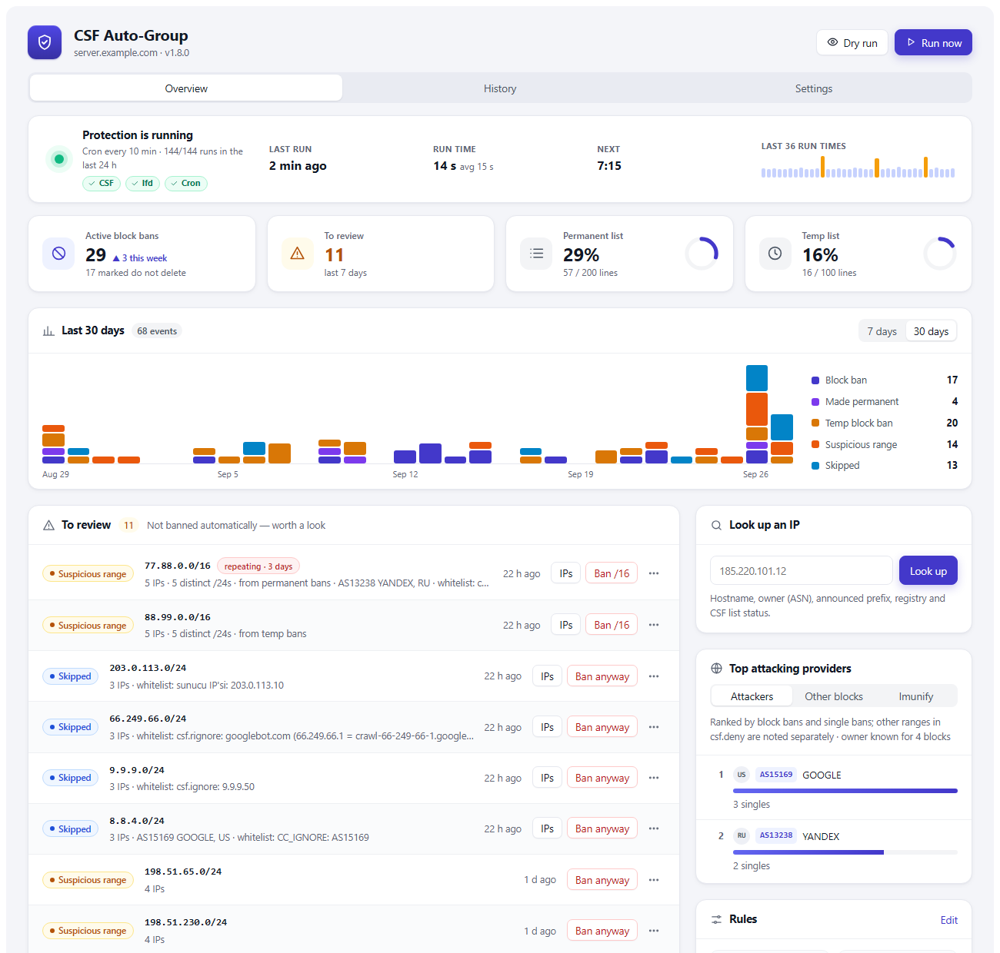
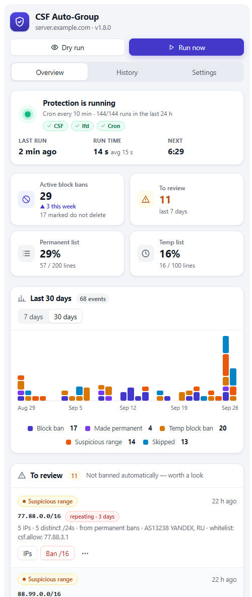

# CSF Auto-Group

**A WHM plugin for ConfigServer Security & Firewall (CSF)** that turns a
scatter of single-IP bans into subnet bans, and gives you one page to see
what your firewall is dealing with and act on it.

Most floods come from the same neighbourhood. When 3–5 already-banned IPs pile
up in a single `/24`, the rest of that range is almost always the same attacker
still coming. CSF Auto-Group bans the **whole `/24`** and drops the singles, so
the attack is blocked before you have to touch anything. A range that comes back
is escalated to a **permanent** ban. `/16` ranges are only flagged for review
(never auto-banned, too broad).



- **Automatic** — a cron job does the grouping every few minutes; the plugin is
  where you watch it and step in.
- **Who is it?** — every block and IP comes with its owner (ASN, organisation,
  country) and hostname, in the page and in alert emails.
- **Safe by default** — never bans a range that touches any CSF whitelist, and
  every manual action asks for confirmation.
- **English / Türkçe** — the plugin, logs and emails.
- **Works on phones** — the page adapts to small screens.

**Version 1.7.3** · root-only WHM plugin on cPanel servers. On servers without
cPanel the same engine runs from cron and the command line
([details](#without-cpanel)).

---

## ⚠️ Read this first

CSF Auto-Group **modifies your firewall**: it bans entire `/24` subnets (256
addresses). A threshold that's too low, or a legitimate visitor whose IP falls in
a banned `/24`, can lock people out.

- **Whitelist your own IPs** in `/etc/csf/csf.allow` (CSF allow overrides deny).
  A `/24` that touches any CSF whitelist is never banned; see
  [Whitelists](#whitelists).
- **Start with high thresholds** and watch the page (or
  `/var/log/csf_autogroup.log`) for a few days before trusting it. *Try before
  saving* in the Settings tab shows what new thresholds would do.
- `/16` is warn-only by design; only `/24`s are auto-banned.

## Install

```bash
git clone https://github.com/ayzeta/csf-autogroup.git
cd csf-autogroup
sudo bash install.sh
```

The installer asks for the language (`en`/`tr`), alert email and cron interval,
writes `config.env`, installs the root cron job and, on cPanel, the plugin under
**WHM → Plugins → CSF Auto-Group**. Re-run it any time.

Only `root` and WHM accounts with the `all` privilege can open the plugin.
Resellers can't.

## Updating

When GitHub has a newer version, the plugin shows a banner: **Update** runs
`update.sh` and **Reload page** loads the new version. From SSH:

```bash
cd csf-autogroup
sudo bash update.sh
```

`update.sh` pulls **only if GitHub is ahead**, then reinstalls with your saved
settings, with no prompts. `config.env` is left untouched.

## The plugin



### Overview

- **Status** — whether protection is running, when the last run was and how long
  it took, a countdown to the next run and the durations of the last 36 runs.
  Turns red when cron has stopped.
- **Summary cards** — active group bans (with this week's change), items to
  review, and how full CSF's permanent and temp lists are.
- **Activity** — a daily chart of group bans, blocks made permanent, temp groups,
  `/16` warnings and whitelist skips over the last 7 or 30 days. Hover a day for
  its breakdown.
- **To review** — `/16` warnings and whitelist-skipped `/24`s from the last 7
  days, with every IP's hostname, owner and ban reason.
- **Active group bans** — a sortable, paged table with each block's owner,
  searchable by CIDR, AS number or organisation. Filters show their counts.
  Blocks that became permanent on a second attack are tagged *repeat*.
- **Watched** — `/24`s that were temp-banned once. If one comes back, it becomes
  permanent + `do not delete`. Sorted by days left.
- **Recent actions** — every ban, promotion, skip, warning and manual change.
- **Look up an IP** — hostname (forward-confirmed), owner, announced prefix,
  registry, whether CSF blocks it and which list whitelists it, with links to
  bgp.he.net and AbuseIPDB. Recently viewed IPs stay one click away.
- **Top attacking networks** — three tabs:
  - *Attackers* — ranked by group bans and single bans. A network with 5+ group
    bans gets a suggestion explaining how to block the whole ASN with CSF's own
    `CC_DENY`. The plugin never edits `csf.conf`.
  - *Other blocks* — ranges in `csf.deny` added outside CSF Auto-Group.
  - *Imunify* (only with Imunify360) — networks in Imunify360's **own** block
    list on this server, with the block reasons. Read-only.
- **Since your last visit** — what happened since you last opened the page; new
  rows carry a dot.

### Actions

Every action asks for confirmation. Risky ones (banning a `/16`, overriding a
whitelist, removing a `do not delete` block) make you type the target.

| Button | Does |
|--------|------|
| Ban /16 | permanent `/16` ban, added as `do not delete` |
| Ban anyway | ban a whitelist-skipped `/24` (overrides the whitelist) |
| Make permanent | make a watched `/24` permanent right away |
| Stop watching | forget a watched `/24` (next attack counts as the first) |
| Remove | lift a group ban (`do not delete` blocks too; `csf.deny` is backed up first) |
| Ignore | hide an item from review for 7/30/90 days (stops `/16` warning emails too) |
| Details | for warnings older than the event log: that day's IPs and reasons from the lfd log |
| Dry run | show what a run would do; changes nothing, sends nothing |
| Run now | run immediately instead of waiting for cron |

Manual actions are logged as `MANUAL (user): …` and appear under recent actions.

### Settings

The same settings as `config.env`, with validation:

- **Notifications** — alert email (with *Send test email*), language, and the
  **weekly summary**: new groups, top attacking networks, watched blocks about to
  expire, list usage and run count. Sent with the first run after 09:00 on the
  chosen day (default Monday).
- **Thresholds** — `/24` ban, `do not delete`, `/16` warning, temp `/24` and temp
  `/16`.
- **Schedule** — cron every 5 / 10 / 15 / 30 minutes or hourly.
- **Lookups** — owner/hostname lookups on or off, DNS timeout.
- **Retention** — watch period, review days, log line limit.

*Try before saving* runs a dry run with the unsaved thresholds. Saving writes
`config.env` (previous file kept as `config.env.bak`), updates the crontab and
logs each change as `SETTING (user): KEY: old → new`. CSF's own list limits
(`DENY_IP_LIMIT`, `DENY_TEMP_IP_LIMIT`) are shown read-only; change them in CSF.

## How grouping works

The escalation ladder: a few bad singles in a range turn into a range ban, and a
range that comes back turns into a permanent one.

| Trigger | Action |
|--------|--------|
| `/24` with **≥3** permanent single bans | permanently ban the `/24`, remove the singles |
| `/24` with **≥5** permanent singles | ban `/24` + `do not delete` |
| `/16` with **≥5** singles across **≥2** `/24`s | warn by email (once/day), no auto-ban |
| `/24` with **≥3** temp bans (first time) | temp-ban the `/24` for 12h, watch it |
| same `/24` seen again | permanent ban + `do not delete` |
| temp `/16` with **≥5** singles / **≥2** `/24`s | warn by email (once/day) |
| deny list **≥80%** of its limit | email alert |

Temp bans already covered by a permanent block are cleared, watch records expire
after 180 days (configurable), and the log is capped. Singles marked
`do not delete` are never removed. A `/24` already covered by a broader block in
`csf.deny` (a `/22`, `/16`, …) is left alone. Folding singles into ranges also
keeps `csf.deny` from overflowing its line limit.

### Owner info

```
185.220.101.0/24 -> 4 permanent singles, permanent ban
   Owner: AS60729 ARTIKEL10, DE
   - 185.220.101.12   berlin01.tor-exit.artikel10.org  (sshd) Failed SSH login
   - 185.220.101.47   tor-exit-47.artikel10.org  (smtpauth) Failed SMTP AUTH login
```

- **Owner** — ASN, organisation and country, from
  [Team Cymru's](https://www.team-cymru.com/ip-asn-mapping) free DNS service (no
  account or API key). Cached for 30 days.
- **Hostname** — each IP's reverse DNS.
- **Reason** — why lfd banned it, from the ban's own comment.

Lookups are plain DNS queries (`dig` or `host`) with a short timeout. Set
`LOOKUP=0` to turn them off. Alert emails end with a link to the plugin
(`https://server:2087/ → Plugins → CSF Auto-Group`).

### Whitelists

Before banning a `/24` (permanent or temp), CSF Auto-Group checks it against
every list CSF uses to say "don't block this". If **any** entry overlaps the
`/24`, nothing is banned and you get one email a day naming the entry:

| Source | What is checked |
|--------|-----------------|
| `csf.allow` (+ `Include`) | IPs, CIDRs, advanced rules (`tcp\|in\|d=22\|s=IP`), hostnames |
| `csf.ignore` (+ `Include`) | IPs and CIDRs |
| `GLOBAL_ALLOW`, `GLOBAL_IGNORE`, `DYNDNS`, temp allows (`csf -ta`) | CSF's cached lists in `/var/lib/csf` |
| Server's own IPs | a `/24` containing one of this server's addresses |
| `CC_IGNORE`, `CC_ALLOW` in `csf.conf` | the block's country code or `ASnnnn` |
| `csf.rignore` | a banned IP whose reverse DNS matches (forward-confirmed, like lfd) |

This matters most for `csf.ignore`: CSF lets `csf.allow` addresses through even
inside a banned range, but `csf.ignore` only stops lfd, so a `/24` ban would
block those addresses. If a check can't be completed because DNS isn't
answering, the block is retried on the next run instead of being banned.

## Without cPanel

CSF Auto-Group works on any CSF server. Without cPanel there is no plugin page;
the cron job does the same grouping and sends the same emails, and everything
the page shows is available from the command line:

```bash
./csf_autogroup.sh --status          # same data as the plugin page
./csf_autogroup.sh --dry-run         # what a run would do, changes nothing
./csf_autogroup.sh --lookup 1.2.3.4  # who is this IP?
./csf_autogroup.sh --digest          # preview the weekly summary
./csf_autogroup.sh --config get      # current settings (--config set KEY=VALUE …)
./csf_autogroup.sh --help
```

Requirements: CSF and a working `mail` command; `dig` or `host` for lookups.

### Manual install

```bash
cp config.env.example config.env      # edit ALERT_MAIL, MSG_LANG, thresholds
chmod 700 csf_autogroup.sh
( crontab -l 2>/dev/null; echo '*/10 * * * * /path/to/csf_autogroup.sh >/dev/null 2>&1' ) | crontab -
```

## Configuration

All settings live in `config.env` next to the script (see
[`config.env.example`](config.env.example)) and can be edited from the Settings
tab. Key options:

- `MSG_LANG` — `en` or `tr` (plugin, logs, emails and `csf.deny` comments).
- `ALERT_MAIL` — where alerts go.
- `THRESHOLD_24`, `THRESHOLD_24_PERMANENT`, `THRESHOLD_16`, `THRESHOLD_TEMP_24`,
  `THRESHOLD_TEMP_16` — sensitivity.
- `LOOKUP`, `LOOKUP_TIMEOUT` — owner/hostname lookups.

## Uninstall

```bash
crontab -l | grep -v 'csf_autogroup.sh' | crontab -
# WHM plugin (cPanel):
/usr/local/cpanel/bin/unregister_appconfig csf_autogroup
rm -rf /usr/local/cpanel/whostmgr/docroot/cgi/csf_autogroup /var/cpanel/csf_autogroup
rm -f /var/cpanel/apps/csf_autogroup.conf /usr/local/cpanel/whostmgr/docroot/addon_plugins/csf_autogroup.svg
# optional:
rm -f /var/log/csf_autogroup.log
rm -rf /var/lib/csf_autogroup
```

Existing `/24` bans stay in `csf.deny` until you remove them (`csf -dr <cidr>`).

## License

MIT — see [LICENSE](LICENSE).
