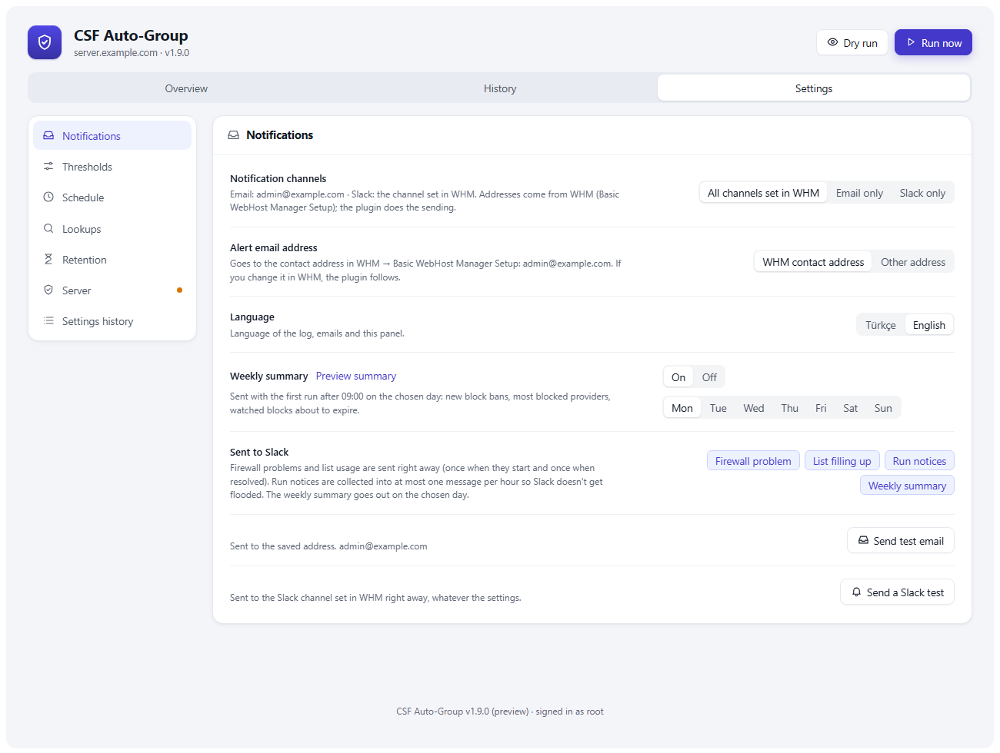
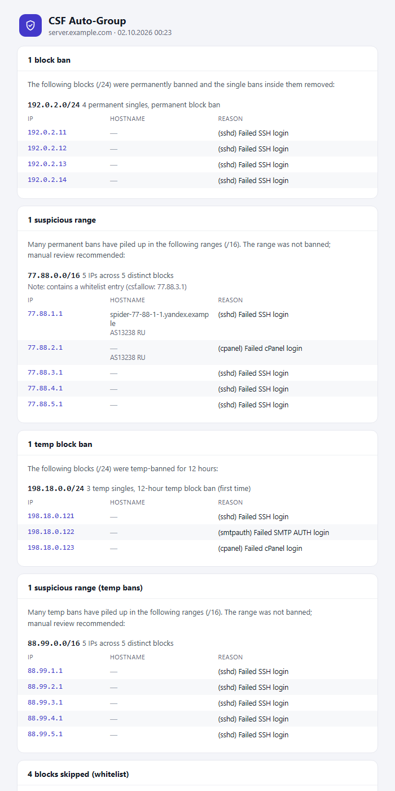

# CSF Auto-Group

**A WHM plugin for ConfigServer Security & Firewall (CSF)** that turns a
scatter of single-IP bans into subnet bans, and gives you one page to see
what your firewall is dealing with and act on it.

Most floods come from the same neighbourhood. When 3–5 already-banned IPs pile
up in a single `/24`, the rest of that range is almost always the same attacker
still coming. CSF Auto-Group bans the **whole `/24`** and drops the singles, so
the attack is blocked before you have to touch anything. A range that comes back
is escalated to a **permanent** ban. `/16` ranges are only flagged for review
(never auto-banned, too broad).


- **Automatic** — a cron job does the grouping every few minutes; the plugin is
  where you watch it and step in.
- **Who is it?** — every block and IP comes with its owner (ASN, organisation,
  country) and hostname, in the page and in alert emails.
- **Safe by default** — never bans a range that touches any CSF whitelist, and
  every manual action asks for confirmation.
- **Email and Slack** — one HTML email per run with everything it did (block
  bans, suspicious ranges, skips, limit and firewall alerts), plus Slack
  messages. Both addresses come from WHM; nothing arrives twice.
- **Watches the firewall itself** — shows whether CSF and LFD are working and
  alerts you if one of them stops.
- **English / Türkçe** — the plugin, logs and emails.
- **Works on phones** — the page adapts to small screens.

**Version 1.9.7** ([changelog](CHANGELOG.md), [roadmap](ROADMAP.md)) · root-only WHM plugin on cPanel servers. On servers without
cPanel the same engine runs from cron and the command line
([details](#without-cpanel)).

**Terms used everywhere** (plugin, emails, log): a *single* is one banned IP, a
*block* is a `/24` (banned automatically), a *range* is a `/16` (never banned,
only flagged as *suspicious*), a *provider* is an ASN.

---

## ⚠️ Read this first

CSF Auto-Group **modifies your firewall**: it bans entire `/24` subnets (256
addresses). A threshold that's too low, or a legitimate visitor whose IP falls in
a banned `/24`, can lock people out.

- **Whitelist your own IPs** in `/etc/csf/csf.allow` (CSF allow overrides deny).
  A `/24` that touches any CSF whitelist is never banned; see
  [Whitelists](#whitelists).
- **Start with high thresholds** and watch the page (or
  `/var/log/csf_autogroup.log`) for a few days before trusting it. *Try before
  saving* in the Settings tab shows what new thresholds would do.
- `/16` is warn-only by design; only `/24`s are auto-banned.

## Install

```bash
git clone https://github.com/ayzeta/csf-autogroup.git
cd csf-autogroup
sudo bash install.sh
```

The installer asks for the language (`en`/`tr`), alert email (`whm` = the
contact address set in WHM, the default) and cron interval,
writes `config.env`, installs the root cron job and, on cPanel, the plugin under
**WHM → Plugins → CSF Auto-Group**. Re-run it any time.

Only `root` and WHM accounts with the `all` privilege can open the plugin.
Resellers can't.

## Updating

When GitHub has a newer version, the plugin shows a banner: **Update** runs
`update.sh` and **Reload page** loads the new version. The page checks on its
own every half hour while it is open; opening **Settings → Server** asks
GitHub again if the last answer is older than two minutes, and **Check for
updates** asks right away. The weekly summary email also mentions a new
version. From SSH:

```bash
cd csf-autogroup
sudo bash update.sh
```

`update.sh` pulls **only if GitHub is ahead**, then reinstalls with your saved
settings, with no prompts. `config.env` is left untouched.

## The plugin


### Overview

- **Status** — whether protection is running, when the last run was and how long
  it took, a countdown to the next run and the durations of the last 36 runs,
  plus three markers: **CSF** (rules loaded, not disabled, not in testing mode),
  **LFD** (running) and **Cron** (runs on time). Turns red when any of them has
  a problem.
- **Summary cards** — active block bans (with this week's change), items to
  review, and how full CSF's permanent and temp lists are.
- **Activity** — a daily chart of block bans, blocks made permanent, temp block
  bans, suspicious ranges and whitelist skips over the last 7 or 30 days. Hover
  a day for its breakdown.
- **To review** — suspicious ranges and whitelist-skipped blocks from the last 7
  days, with every IP's hostname, owner and ban reason. A range flagged on 3 or
  more separate days is marked *repeating* and moves to the top.
- **Active block bans** — a sortable, paged table with each block's owner,
  searchable by CIDR, AS number or organisation. Filters show their counts.
  Blocks that became permanent on a second attack are tagged *repeat
  offender*; temp block bans show their time left. **⋯ → IPs** lists the IPs
  and ban reasons behind any block (from the event log). The
  *Old* filter lists block bans older than the old-block limit (default 365
  days), with a button to remove them all.
- **Watched** — `/24`s that were temp-banned once. If one comes back, it becomes
  permanent + `do not delete`. Sorted by days left; **⋯ → IPs** shows the IPs
  and reasons behind the temp block ban.
- **History** (its own tab) — every ban, promotion, skip, warning and manual
  action, back to the start of the event log: the latest 300 load first and
  **Show more** pages further back. Work from before the event log existed is
  filled in from the log. Click an address to open its IP card.
  Settings changes are listed under Settings → Settings history.
- **Look up an IP** — hostname (forward-confirmed), owner, announced prefix,
  registry, and **every** level at which CSF blocks it: the single ban, the
  covering `/24`, `/16` or other range (with its state, date and main ban
  reason), port-limited `csf.deny` rules for that address, and `CC_DENY` /
  `CC_DENY_PORTS` when its country or ASN is listed there. Also which list
  whitelists it (port-only `csf.allow` rules are shown with their ports), with
  links to bgp.he.net and AbuseIPDB, and buttons to ban its `/24` or `/16`.
  Recently viewed IPs stay one click away.
- **Inside a wider ban** — a block inside a banned `/16` (or any wider range) is
  tagged *inside /16* in Active block bans and Watched.
- **Most blocked providers** (by ASN) — three tabs:
  - *CSF* — ranked by block bans and single bans, with each provider's most
    common ban reason. A provider with 5+ block
    bans gets a suggestion explaining how to block the whole ASN with CSF's own
    `CC_DENY`. The plugin never edits `csf.conf`.
  - *Other blocks* — ranges in `csf.deny` added outside CSF Auto-Group.
  - *Imunify* (only with Imunify360) — providers in Imunify360's **own** block
    list on this server, with the block reasons. Read-only.
- **Since your last visit** — what happened since you last opened the page; new
  rows carry a dot.

### Actions

Every action asks for confirmation. Risky ones (banning a `/16`, overriding a
whitelist, removing a `do not delete` block) make you type the target.

Manual `/24` and `/16` bans open the same window: it first lists what is inside
the range (CSF Auto-Group block bans, single bans, temp bans, watched blocks,
other ranges and port-limited rules), shows any whitelist overlap, and offers
**Remove covered entries** (on by default): the block bans and single bans
inside leave the permanent list and the temp bans leave the temp list, freeing
lines. Singles marked `do not delete` and ranges added by others are never
touched; watching ends for blocks inside. If the ban is removed later the
removed entries don't come back (LFD bans them again if the attacks continue).
The removed IPs and their ban reasons are kept with the new ban (**⋯ → IPs**).
A range containing one of this server's own IPs can't be banned at all.

| Button | Does |
|--------|------|
| Ban range (/16) | permanent `/16` ban, added as `do not delete`: from To review, **⋯** in Active block bans and Watched, and the IP card |
| Ban block (/24) | permanent `/24` ban from the IP card |
| Ban anyway | ban a whitelist-skipped `/24` (overrides the whitelist) |
| Make permanent | make a watched `/24` permanent right away |
| Stop watching | forget a watched `/24` (next attack counts as the first) |
| Remove | lift a block ban (`do not delete` blocks too; `csf.deny` is backed up first) |
| Remove old ones | on the *Old* filter: remove every block ban older than the old-block limit |
| Ignore | hide an item from review for 7/30/90 days (stops `/16` warning emails too) |
| IPs | a block's IPs and ban reasons, as recorded in the event log |
| Dry run | show what a run would do; changes nothing, sends nothing |
| Run now | run immediately instead of waiting for cron |

Manual actions are logged as `MANUAL (user): …` and appear on the History tab.

### Settings

The same settings as `config.env`, with validation, grouped into sections
(notifications, thresholds, schedule, lookups, retention, server, settings
history):

- **Notifications** — channels: *all channels set in WHM* (default: email +
  Slack), *email only* or *Slack only*. Both addresses come from WHM: the
  contact email in Basic WebHost Manager Setup (or any other address you type)
  and the Slack address set there, which is read at send time and never stored
  by the plugin. The plugin sends the HTML emails and Slack messages itself, so
  nothing arrives twice. Choose which events go to Slack (firewall problem,
  list filling up, run notices, weekly summary): urgent ones go right away,
  run notices are collected into at most one Slack message per hour. *Send test
  email*, *Send a Slack test*, language, and the **weekly summary**: new block
  bans, providers CSF and Imunify360 block most, watched blocks about to
  expire, list usage, run health, and a note when a new version is available.
  Sent with the first run after 09:00 on the chosen day (default Monday).



- **Thresholds** — block ban (`/24`), `do not delete`, suspicious range (`/16`),
  temp block ban (`/24`) and suspicious range from temp bans (`/16`).
- **Schedule** — cron every 5 / 10 / 15 / 30 minutes or hourly.
- **Lookups** — owner/hostname lookups on or off, DNS timeout.
- **Retention** — watch period, review days, old-block limit (default 365 days)
  and whether old block bans are removed automatically (default off; manual bans
  are never touched), log size and archive count. The
  log is rotated by the system's logrotate (`/etc/logrotate.d/csf_autogroup`,
  written from these settings; default 1 MB, 5 compressed archives); where
  logrotate is missing, a log line limit is used instead. A run where
  nothing happened leaves a single line in the log.

A **Server requirements** card lists the tools CSF Auto-Group uses (CSF, cron,
mail, dig/host, logrotate, flock, timeout, git, Imunify360, ModSecurity hit log,
sqlite3) and what happens when one of them is missing.

*Try before saving* runs a dry run with the unsaved thresholds. Saving writes
`config.env` (previous file kept as `config.env.bak`), updates the crontab and
logs each change as `SETTING (user): KEY: old → new`. CSF's own list limits
(`DENY_IP_LIMIT`, `DENY_TEMP_IP_LIMIT`) are shown read-only; change them in CSF.

## How grouping works

The escalation ladder: a few bad singles in a range turn into a range ban, and a
range that comes back turns into a permanent one.

| Trigger | Action |
|--------|--------|
| `/24` with **≥3** permanent single bans | permanently ban the `/24`, remove the singles |
| `/24` with **≥5** permanent singles | ban `/24` + `do not delete` |
| `/16` with **≥5** singles across **≥2** `/24`s | flag as suspicious range by email (once/day), no auto-ban |
| `/24` with **≥3** temp bans (first time) | temp-ban the `/24` for 12h, watch it |
| same `/24` seen again | permanent ban + `do not delete` |
| temp `/16` with **≥5** singles / **≥2** `/24`s | flag as suspicious range by email (once/day) |
| deny list **≥80%** of its limit | alert: email once a day; Slack once when it starts and once when resolved |
| CSF disabled / in testing mode / rules not loaded, or LFD not running | alert: email once a day; Slack once when it starts and once when resolved |
| block ban older than the old-block limit (optional) | remove it |

Temp bans already covered by a permanent block are cleared, watch records expire
after 180 days (configurable), and the log is capped. Singles marked
`do not delete` are never removed. A `/24` already covered by a broader block in
`csf.deny` (a `/22`, `/16`, …) is left alone. Folding singles into ranges also
keeps `csf.deny` from overflowing its line limit.

### Owner info

Each run sends at most one email; its subject sums up the run, e.g.
`CSF Auto-Group: 2 block bans · 1 suspicious range · 1 temp block ban`. Emails
are HTML (cards and tables that also work in desktop Outlook) with a plain-text
part for clients that don't show HTML.



The plain-text part looks like this:

```
185.220.101.0/24 -> 4 permanent singles, permanent block ban
   Owner: AS60729 ARTIKEL10, DE
   - 185.220.101.12   berlin01.tor-exit.artikel10.org  (sshd) Failed SSH login
   - 185.220.101.47   tor-exit-47.artikel10.org  (smtpauth) Failed SMTP AUTH login
```

- **Owner** — ASN, organisation and country, from
  [Team Cymru's](https://www.team-cymru.com/ip-asn-mapping) free DNS service (no
  account or API key). Cached for 30 days.
- **Hostname** — each IP's reverse DNS.
- **Reason** — why LFD banned it, from the ban's own comment. ModSecurity bans
  show the rule's message (e.g. `ModSecurity 1302: WP LOGIN VIEW RATE LIMIT…`),
  read from cPanel's ModSecurity hit log with `sqlite3`, or from the rule file
  named in the ModSecurity log when that isn't available.

Lookups are plain DNS queries (`dig` or `host`) with a short timeout. Set
`LOOKUP=0` to turn them off. Alert emails end with a link to the plugin
(`https://server:2087/ → Plugins → CSF Auto-Group`).

### Whitelists

Before banning a `/24` (permanent or temp), CSF Auto-Group checks it against
every list CSF uses to say "don't block this". If **any** entry overlaps the
`/24`, nothing is banned and you get one email a day naming the entry:

| Source | What is checked |
|--------|-----------------|
| `csf.allow` (+ `Include`) | IPs, CIDRs, hostnames, and port-only rules (`tcp\|in\|d=2083\|s=IP`) for a specific address or range; rules that open a port to everyone (`s=0.0.0.0/0`, anything wider than `/8`) are port rules, not whitelist entries |
| `csf.ignore` (+ `Include`) | IPs and CIDRs |
| `GLOBAL_ALLOW`, `GLOBAL_IGNORE`, `DYNDNS`, temp allows (`csf -ta`) | CSF's cached lists in `/var/lib/csf` |
| Server's own IPs | a `/24` containing one of this server's addresses |
| `CC_IGNORE`, `CC_ALLOW` in `csf.conf` | the block's country code or `ASnnnn` |
| `csf.rignore` | a banned IP whose reverse DNS matches (forward-confirmed, like LFD) |
| Imunify360 whitelist (only with Imunify360) | the server's local whitelist: manual entries and search engine bots Imunify whitelisted; expired entries are ignored, refreshed hourly |

This matters most for `csf.ignore`: CSF lets `csf.allow` addresses through even
inside a banned range, but `csf.ignore` only stops LFD, so a `/24` ban would
block those addresses. If a check can't be completed because DNS isn't
answering, the block is retried on the next run instead of being banned.

## Without cPanel

CSF Auto-Group works on any CSF server. Without cPanel there is no plugin page;
the cron job does the same grouping and sends the same emails, and everything
the page shows is available from the command line:

```bash
./csf_autogroup.sh --status          # same data as the plugin page
./csf_autogroup.sh --dry-run         # what a run would do, changes nothing
./csf_autogroup.sh --lookup 1.2.3.4  # who is this IP?
./csf_autogroup.sh --inside 1.2.0.0/16   # what a manual /16 (or /24) ban would cover
./csf_autogroup.sh --events latest 0 50   # the latest 50 events as JSON (after|before TIME N pages)
./csf_autogroup.sh --digest          # preview the weekly summary
./csf_autogroup.sh --config get      # current settings (--config set KEY=VALUE …)
./csf_autogroup.sh --help
```

Requirements: CSF and a working `sendmail` (HTML emails) or `mail` command
(plain text); `dig` or `host` for lookups. Optional: `sqlite3` (ModSecurity rule
messages in ban reasons) and `curl` (Slack).

### Manual install

```bash
cp config.env.example config.env      # edit ALERT_MAIL, MSG_LANG, thresholds
chmod 700 csf_autogroup.sh
( crontab -l 2>/dev/null; echo '*/10 * * * * /path/to/csf_autogroup.sh >/dev/null 2>&1' ) | crontab -
```

## Configuration

All settings live in `config.env` next to the script (see
[`config.env.example`](config.env.example)) and can be edited from the Settings
tab. Key options:

- `MSG_LANG` — `en` or `tr` (plugin, logs, emails and `csf.deny` comments).
- `ALERT_MAIL` — where alert emails go: `whm` (the contact address set in WHM,
  default) or an email address.
- `NOTIFY` — `all` (email + Slack, default), `email` or `slack`.
- `IC_FIREWALL`, `IC_LISTFULL`, `IC_RUN`, `IC_DIGEST` — which events go to Slack;
  `SLACK_BATCH_MIN` — run notices go to Slack at most this often (default 60).
- `THRESHOLD_24`, `THRESHOLD_24_PERMANENT`, `THRESHOLD_16`, `THRESHOLD_TEMP_24`,
  `THRESHOLD_TEMP_16` — sensitivity.
- `LOOKUP`, `LOOKUP_TIMEOUT` — owner/hostname lookups.

## Uninstall

```bash
crontab -l | grep -v 'csf_autogroup.sh' | crontab -
# WHM plugin (cPanel):
/usr/local/cpanel/bin/unregister_appconfig csf_autogroup
rm -rf /usr/local/cpanel/whostmgr/docroot/cgi/csf_autogroup /var/cpanel/csf_autogroup
rm -f /var/cpanel/apps/csf_autogroup.conf /usr/local/cpanel/whostmgr/docroot/addon_plugins/csf_autogroup.svg
rm -f /etc/logrotate.d/csf_autogroup
# optional:
rm -f /var/log/csf_autogroup.log
rm -rf /var/lib/csf_autogroup
```

Existing `/24` bans stay in `csf.deny` until you remove them (`csf -dr <cidr>`).

## License

MIT — see [LICENSE](LICENSE).
